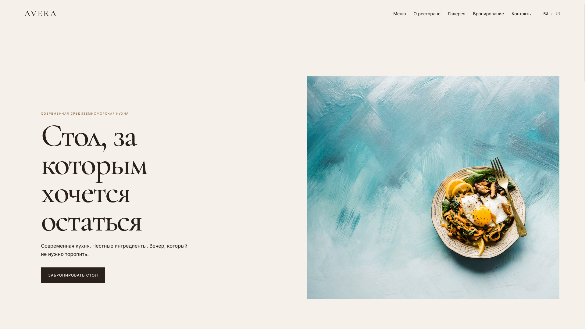
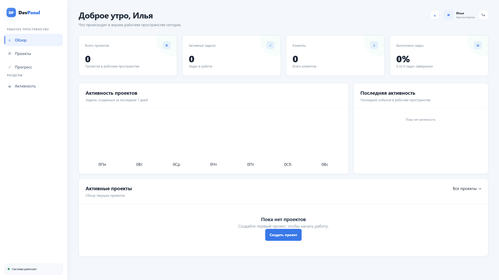
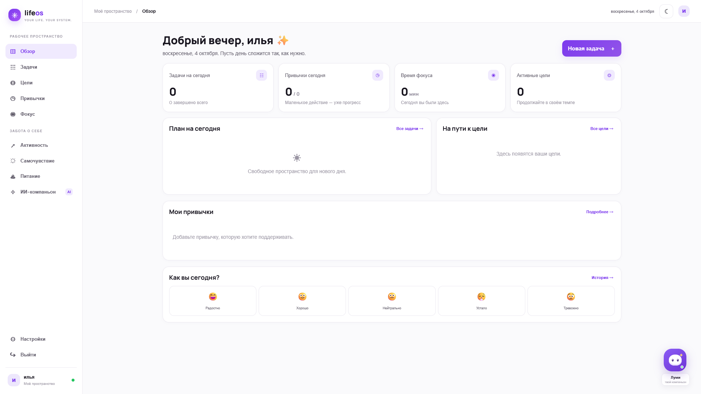
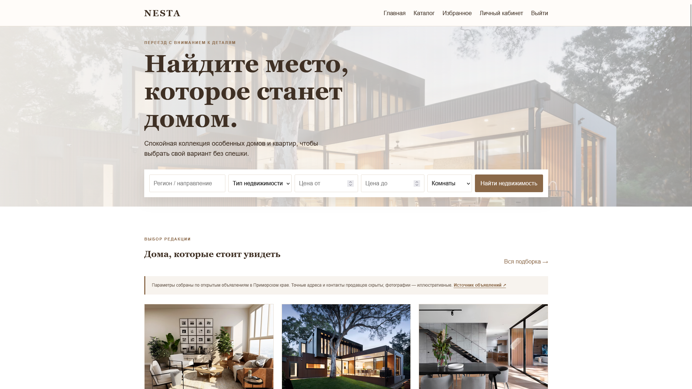

# Портфолио

### Веб-проекты, в которых идея встречается с интерфейсом

Четыре проекта — от ресторанного сайта до личного планировщика. Нажмите на название или изображение, чтобы посмотреть проект.

[GitHub · @xirsoev](https://github.com/xirsoev) · [Все репозитории ↗](https://github.com/xirsoev?tab=repositories)

---

## Проекты

### 🍋 [AVERA ↗](https://github.com/xirsoev/AVERA)

Сайт ресторана современной средиземноморской кухни: меню, галерея, история и бронирование на русском и английском языках.

`HTML` `CSS` `JavaScript`

---

### 🧩 [DevPanel ↗](https://github.com/xirsoev/DevPanel)

Рабочее пространство для проектов и задач со статусами, сроками, прогрессом и общей панелью активности.

`PHP` `MySQL` `PDO` `JavaScript`

---

### ✨ [LifeOS ↗](https://github.com/xirsoev/lifeos-public) · [Открыть сайт ↗](https://lifeos-production-a1a8.up.railway.app/)

Личное пространство для задач, целей и привычек с фокус-сессиями, дневником питания и помощником Луми.

`Node.js` `JavaScript` `Gemini API`

---

### 🏡 [NESTA ↗](https://github.com/xirsoev/nesta-Website-)

Каталог домов и квартир с фильтрами, страницами объектов, избранным и управлением объявлениями.

`PHP` `MySQL` `JavaScript`

---

[Все проекты на GitHub ↗](https://github.com/xirsoev?tab=repositories)

